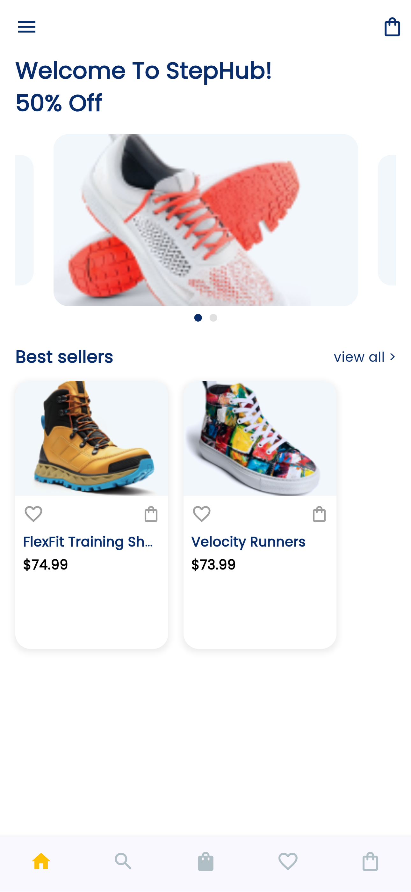
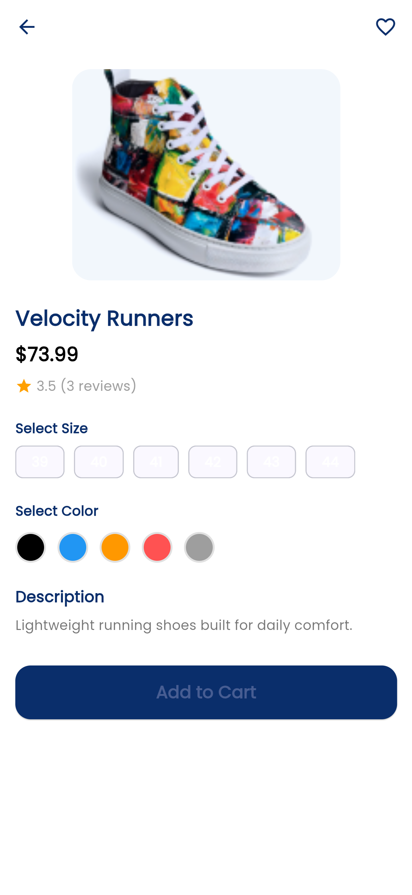
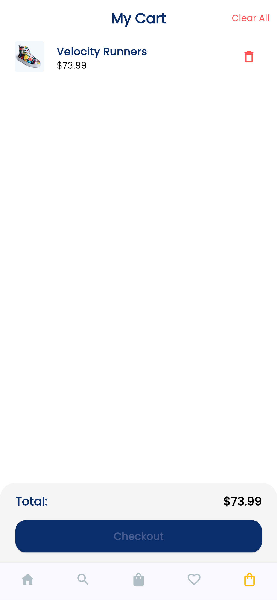
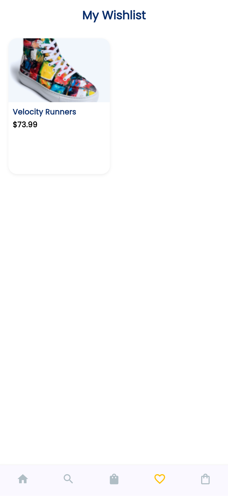

# 🛍️ StepHub – Aplikasi E-Commerce Penjualan Sepatu

**StepHub** adalah aplikasi e-commerce sederhana berbasis **Flutter** yang dirancang untuk menjual berbagai jenis sepatu secara online.  
Proyek ini dikembangkan sebagai tugas **Ujian Tengah Semester (UTS)** pada mata kuliah **Mobile Programming**, dengan fokus pada implementasi desain antarmuka (UI) dari Figma menjadi aplikasi mobile yang fungsional.

---

## 📱 Fitur Utama
- 🏠 **Splash & Home Screen**  
  Menampilkan logo aplikasi dan daftar produk unggulan.

- 🧩 **Categories Page**  
  Menyediakan berbagai kategori sepatu agar pengguna mudah menelusuri produk.

- 🛒 **Shop Page**  
  Menampilkan seluruh produk sepatu dalam bentuk grid, dilengkapi fitur *sorting* berdasarkan harga dan rating.

- 👟 **Product Detail Page**  
  Menampilkan detail lengkap produk (nama, harga, gambar, dan deskripsi) serta tombol “Add to Cart” dan “Add to Wishlist”.

- ❤️ **Wishlist Page**  
  Menyimpan produk favorit pengguna menggunakan state management `Provider`.

- 🧺 **Cart Page**  
  Menampilkan daftar produk yang telah ditambahkan ke keranjang belanja dengan fitur “Clear All” untuk menghapus semua item sekaligus.

- 🎨 **UI Modern dan Responsif**  
  Menggunakan desain dari **Figma**, warna dominan biru tua (#0A2E6B), dan font **Poppins** dari Google Fonts.

---

## 🧠 Teknologi yang Digunakan
| Komponen | Deskripsi |
|----------|------------|
| **Framework** | Flutter 3.19+ |
| **Bahasa** | Dart |
| **State Management** | Provider |
| **IDE** | Visual Studio Code |
| **Desain UI** | Figma |
| **Font** | Google Fonts (Poppins) |
| **Animasi Navigasi** | PageRouteBuilder (Fade & Slide Transitions) |

---

## 🗂️ Struktur Folder
```
lib/
│
├── main.dart
├── models/
│   └── shoe_model.dart
├── providers/
│   ├── cart_provider.dart
│   └── wishlist_provider.dart
├── screens/
│   ├── splash_screen.dart
│   ├── home_screen.dart
│   ├── categories_screen.dart
│   ├── shop_screen.dart
│   ├── product_detail_screen.dart
│   ├── cart_screen.dart
│   └── wishlist_screen.dart
├── utils/
│   ├── dummy_data.dart
│   └── page_transition.dart
└── widgets/
    └── product_card.dart
```

---

## 💾 Instalasi dan Menjalankan Aplikasi

1. **Clone repositori ini**
   ```bash
   git clone https://github.com/username/stephub.git
   ```
2. **Masuk ke folder proyek**
   ```bash
   cd stephub
   ```
3. **Install dependencies**
   ```bash
   flutter pub get
   ```
4. **Jalankan aplikasi**
   ```bash
   flutter run
   ```

---

## 🖼️ Tampilan Aplikasi
| Halaman | Screenshot |
|----------|-------------|
| Splash Screen |  |
| Home Page |  |
| Shop Page |  |
| Product Detail |  |
| Cart Page |  |
| Wishlist Page |  |


---

## 🧩 Cuplikan Kode Penting

### Navigasi dengan Animasi Fade
```dart
Navigator.push(
  context,
  PageRouteBuilder(
    pageBuilder: (_, __, ___) => ProductDetailScreen(shoe: shoe),
    transitionsBuilder: (_, animation, __, child) =>
        FadeTransition(opacity: animation, child: child),
  ),
);
```

### Pengelolaan Keranjang Belanja
```dart
final cart = Provider.of<CartProvider>(context, listen: false);
cart.addToCart(shoe);
```

---

## 👨‍💻 Pengembang
| Nama | Muhammad Abyan |
|------|----------------|
| NIM | 230605110079 |
| Mata Kuliah | Mobile Programming |
| Dosen Pengampu | A’la Syauqi, M.Kom |
| Tahun | 2025 |

---

## 📜 Lisensi
Proyek ini dibuat untuk keperluan akademik dan pembelajaran.  
Anda bebas memodifikasi dan mengembangkan proyek ini selama mencantumkan kredit kepada pengembang asli.

---

### 💬 Catatan
> Proyek **StepHub** membuktikan bahwa Flutter dapat digunakan untuk membangun aplikasi e-commerce modern dengan tampilan profesional dan performa yang optimal, bahkan oleh pengembang pemula. 🚀
